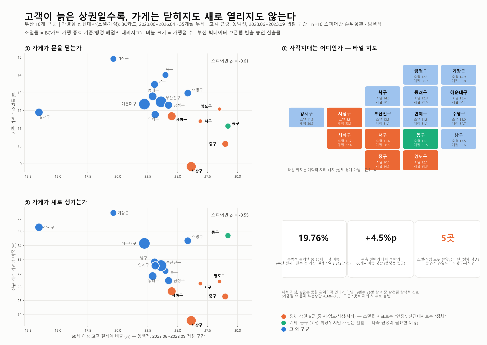

# Closing Neither Doors Nor Opening New Ones

*[한국어 README](README.ko.md)*

Busan's older commercial districts are in **metabolic arrest** — storefronts neither shut down
nor open up. Indicators that count only closures read that as stability, which is where the
blind spot is.

Entry for the **2026 Busan Big Data Utilization Competition** (분석·시각화 부문).
Analysis was carried out inside the Busan Data Open Lab across three on-site visits; every
number below comes from an output that passed the Lab's export review.

---

## What the data showed

The project started from a different hypothesis — that **cost pressure predicts merchants
disappearing**. It does not. The data declined to support it, and what surfaced instead was
the metabolism problem.

| Question | Result |
|---|---|
| Does cost pressure (MPI) predict merchant disappearance? | **Not supported** |
| Is there a blind spot in how district-level distress is judged? | **Yes** |
| What state is merchant metabolism in, in older districts? | **Captured** — terminations and openings both low |

Across Busan's 16 districts, the share of card spending from customers aged 60+ moves against
both merchant metabolism indicators:

- merchant disappearance rate — Spearman **ρ = -0.61**
- new merchant opening rate — Spearman **ρ = -0.55**

Partial correlations controlling for merchant count hold the sign (-0.68 / -0.66), and the
sign survives leave-one-district-out.

**Five districts** (중구·서구·영도구·사상구·사하구) sit below the median on *both* indicators.
A closure-only metric calls them stable; on metabolism they read as stagnant. 동구 is the
instructive exception — oldest customer base, yet openings stay high, which is precisely why a
single-axis judgement is not enough.

---

## Method

**Cost pressure index (MPI)** = purchases ÷ sales, standardized across industry major-categories
so district-level industry mix does not drive the ranking (rank preserved at r = 0.776).

**Metabolism indicators**
- disappearance rate = merchants whose BC Card affiliation ended over 35 months ÷ existing merchants
- new opening rate = newly opened merchants ÷ (existing + new)

**Statistics** — Spearman rank correlation (non-parametric, n = 16), sensitivity checks,
permutation testing.

---

## Data and attribution

> **출처 : 부산 데이터 오픈랩**
> KCD 사업장 매출·매입 (SPN088·089·090), 2023.06–2026.04
> 가맹점 개·폐점 (SPN082), 2023.06–2026.04
>
> Source attribution is a condition of the Open Lab's export approval, not a courtesy.

Supplementary open data from **Big-데이터웨이브** (data.busan.go.kr): Dongbaekjeon local-currency
merchant listings and age-banded consumption. Elderly population share cross-checked against KOSIS.

`0_부산 데이터 오픈랩 09.03. 반출 신청 데이터_260904/` holds the nine approved outputs. They are
aggregates at district level — no row-level or merchant-level source data left the Lab, and none
is reproduced here.

---

## Reading the numbers honestly

- **"가맹점 소멸" is not "폐업."** It means a BC Card merchant affiliation ended, which is a proxy
  for administrative closure, not the same thing. The report uses the former throughout, and so
  should anyone quoting it.
- **The correlations are exploratory.** n = 16 districts, and they emerged while exploring 36
  variable pairs. Under Bonferroni/FDR correction the headline pair does not reach confirmatory
  significance — it is reported as a *directional* hypothesis backed by four robustness checks,
  not a confirmed effect. The figures describe co-movement, not causation, and should not be
  restated as causal.
- **Elderly share by district** is quoted from `out7` only — `out3` is computed over a different
  window and the two are not interchangeable.

---

## Status

Submission deadline 2026-09-18; final presentation round 2026-10-29. The written report is still
being finalised, so this repository currently holds the analysis, the approved outputs, the
visualization, and the report source materials rather than a finished paper.

Team of two.
